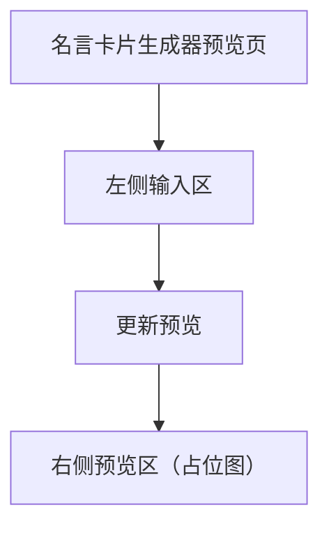

## 1. Product Overview
“名言卡片生成器”基础 UI 预览界面，用于在同一页面完成名言内容输入并在右侧看到卡片预览占位图。
面向需要快速制作名言卡片预览的普通用户，先满足基础布局与输入-预览联动。

## 2. Core Features

### 2.1 Feature Module
本产品（MVP）由以下页面构成：
1. **名言卡片生成器预览页**：左右分栏布局、左侧输入区、右侧占位图预览。

### 2.3 Page Details
| Page Name | Module Name | Feature description |
|-----------|-------------|---------------------|
| 名言卡片生成器预览页 | 页面框架（左右分栏） | 展示桌面端左右分栏：左侧固定输入区，右侧预览区；在窄屏时按顺序上下堆叠（先输入后预览）。 |
| 名言卡片生成器预览页 | 左侧输入区 | 输入名言正文（多行文本）；输入作者/来源（单行，可选）；提供“更新预览”触发器，使右侧预览随输入变化刷新（可为实时或按钮触发）。 |
| 名言卡片生成器预览页 | 右侧预览区（占位图） | 显示名言卡片预览占位图：在未输入或未更新时显示占位状态；更新后在占位图上以文本叠加方式展示名言与作者的预览效果（不要求真实渲染引擎，允许简化）。 |
| 名言卡片生成器预览页 | 基础状态提示 | 当名言正文为空时提示需要输入；当预览不可用时显示占位文案（例如“预览将在这里显示”）。 |

## 3. Core Process
- 用户进入“名言卡片生成器预览页”。
- 用户在左侧输入区填写名言正文（可选填写作者/来源）。
- 用户触发“更新预览”（或输入即时更新），右侧预览区显示对应的卡片占位预览效果。

