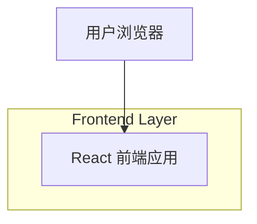

## 1.Architecture design

## 2.Technology Description
- Frontend: React@18 + vite + tailwindcss@3
- Backend: None

## 3.Route definitions
| Route | Purpose |
|-------|---------|
| / | 名言卡片生成器预览页：左右分栏布局、左侧输入、右侧占位预览 |
